# 📱 NutriFit – Kalkulator BMI & Panduan Kesehatan

NutriFit adalah aplikasi Flutter yang dirancang untuk membantu Anda memahami kondisi kesehatan melalui perhitungan Indeks Massa Tubuh (IMT/BMI) secara cepat dan akurat. Selain hanya memberikan hasil BMI, NutriFit juga menghadirkan rekomendasi kesehatan yang dipersonalisasi sesuai kategori BMI Anda. Setiap kategori seperti Underweight (kurus), Normal, Overweight (berat badan lebih), atau Obesitas memiliki saran yang berbeda, meliputi motivasi, rekomendasi makanan bergizi, serta tips olahraga dan gaya hidup sehat yang relevan.

Aplikasi ini juga dilengkapi fitur riwayat BMI yang memungkinkan pengguna melihat kembali data perhitungan sebelumnya, lengkap dengan filter tanggal agar lebih mudah dilacak. Untuk kenyamanan penggunaan, NutriFit menyediakan dua mode tampilan, yaitu mode terang dan mode gelap, yang dapat disesuaikan dengan preferensi pengguna.

Sebagai bentuk keterbukaan, aplikasi ini turut menyediakan kontak developer apabila pengguna ingin bertanya, melaporkan masalah, atau memberikan masukan. Dengan antarmuka yang bersih, fitur yang cerdas, dan pengalaman penggunaan yang nyaman, NutriFit hadir untuk membantu Anda memulai gaya hidup yang lebih sehat dan lebih terarah.

---

## 🧑‍💻 Info Pengembang

|  |  |
|-----------|-----------------------|
| Nama      | Junioka Bayu Gionanda |
| NIM       | 2205101060 |
| Kelas     | 7C / TIF |

Projek ini dibuat untuk memenuhi tugas Ujian Semester Akhir (UAS) pada mata kuliah Pemrograman Mobile 2 / Pemrogramman Bergerak

---

## 📸 Screenshots

### **Halaman Awal | Halaman Kalkulator BMI | Halaman Hasil BMI**

| Halaman Awal                                   | Kalkulator BMI                                    | Hasil BMI                                          |
| ---------------------------------------- | -------------------------------------- | ----------------------------------------------- |
| 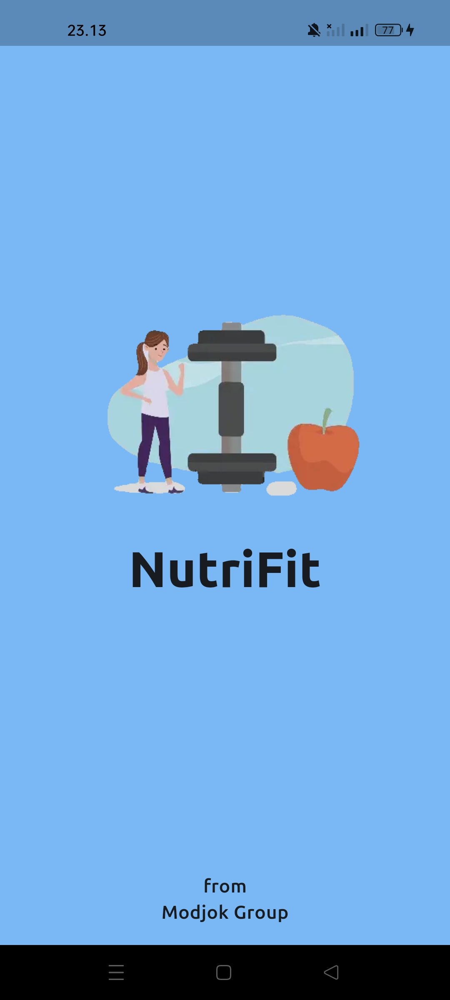 | 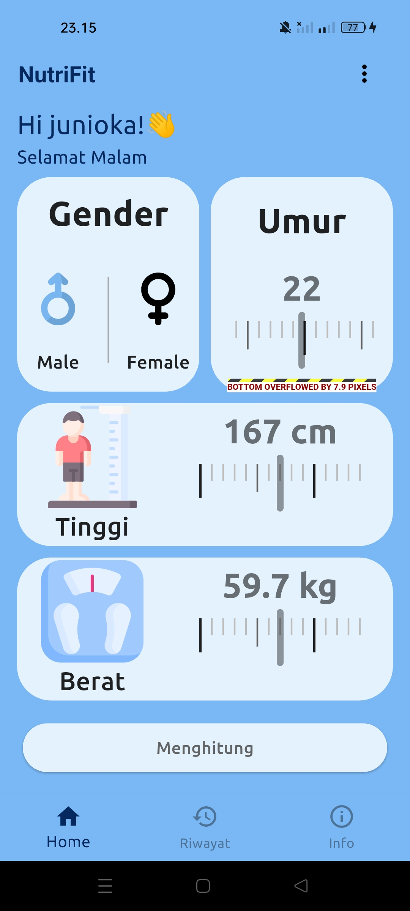 | 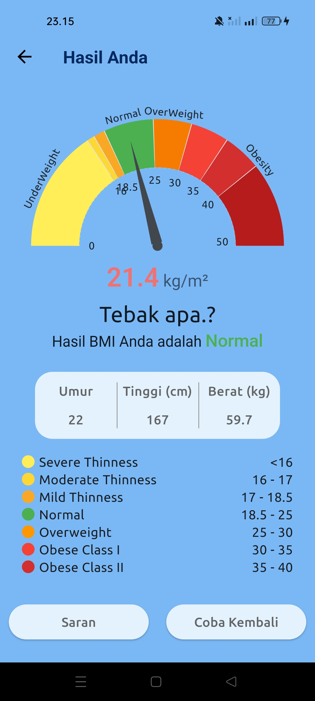 |
| 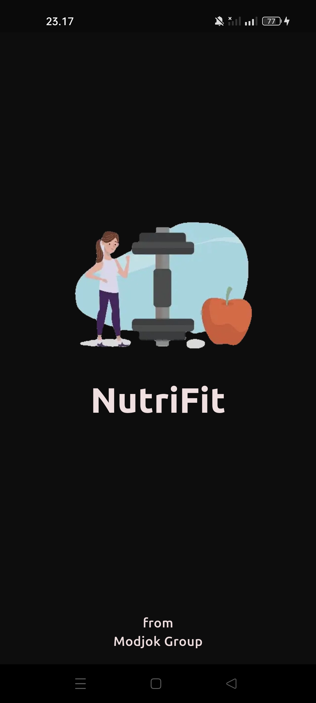   | 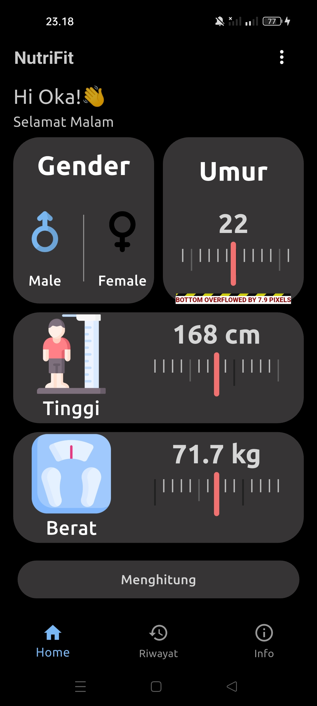   | 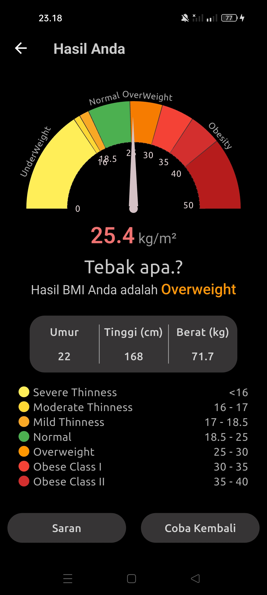   |

### **Halaman Saran | Halaman Mulai | Halaman Pengembang**

| Saran                                      | Mulai                                             | Pengembang                                           |
| ----------------------------------------------- | ------------------------------------------------- | ---------------------------------------------------- |
| 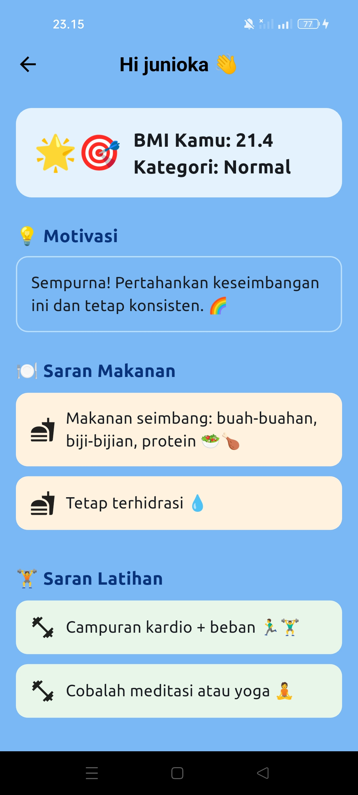 | 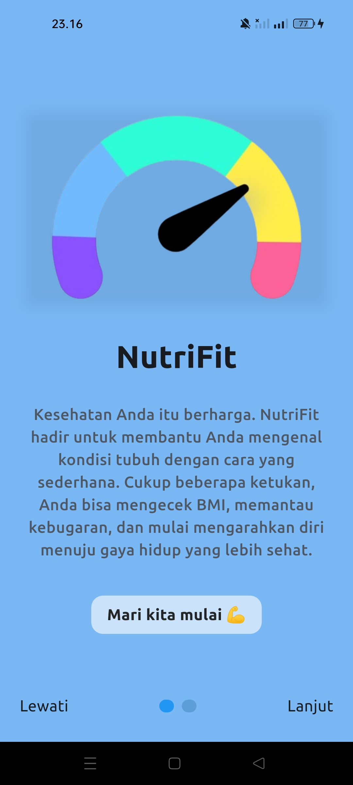 | 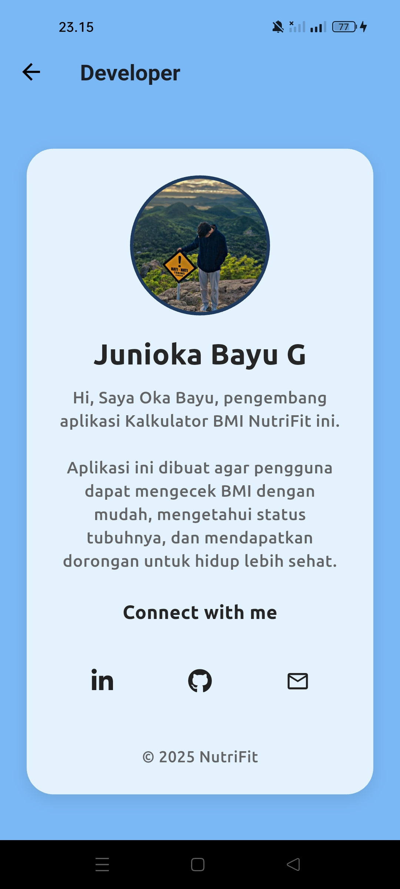 |
| 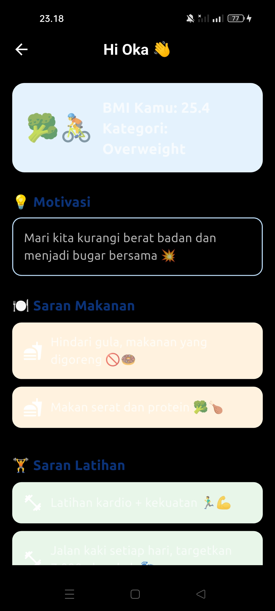   | 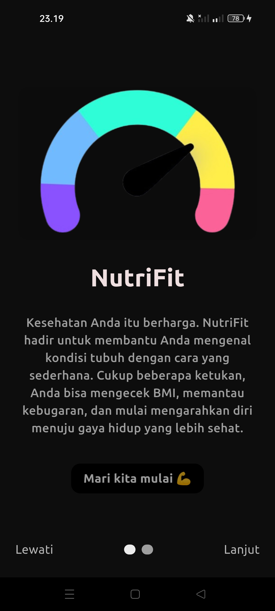   | 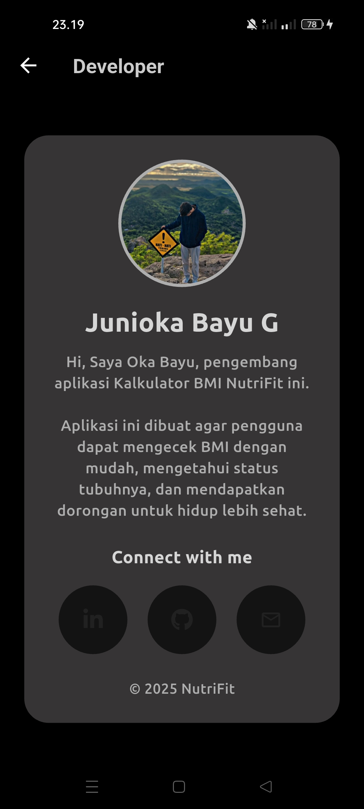   |

<!-- ### **Riwayat | Info | Ubah Nama**

| Riwayat                                      | Info                                             | Ubah Nama                                             |  
| ----------------------------------------------- |------------------------------------------------- | ------------------------------------------------- |
| 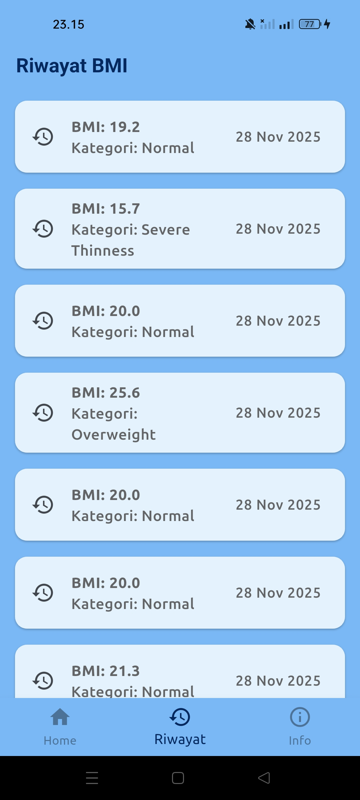 | 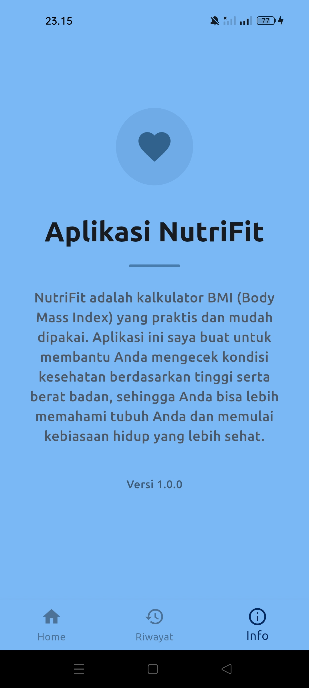 | 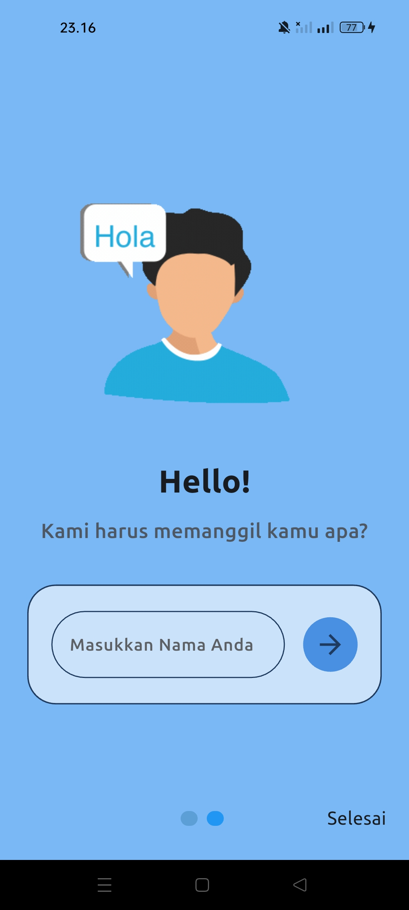 |
| 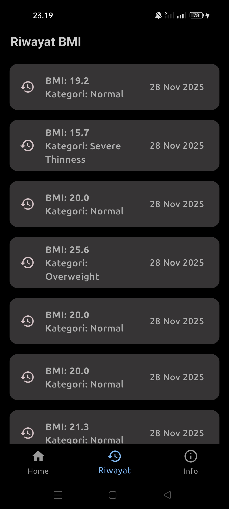 | 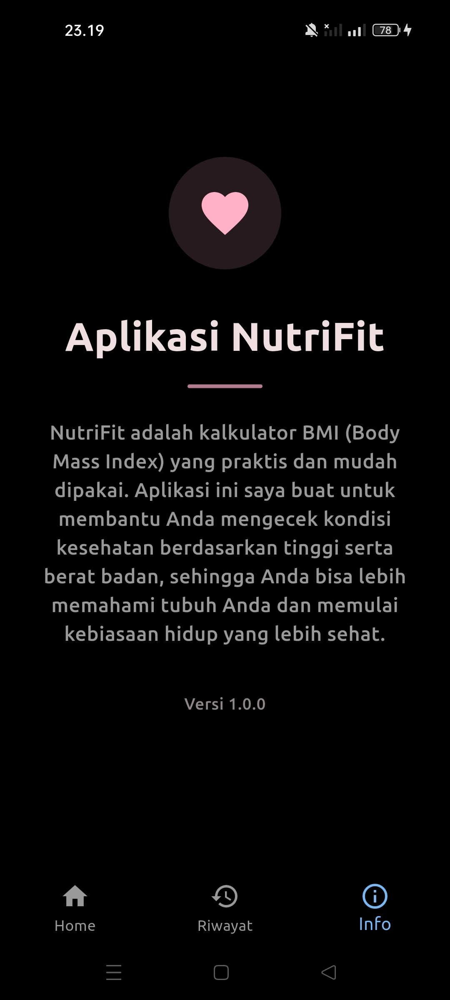 | 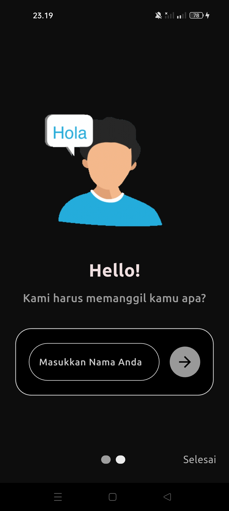 | -->

### **Halaman Riwayat BMI | Halaman Info Aplikasi | Halaman Nama | Halaman Menu Pop Up**

| Riwayat                                      | Info                                             | Nama                                             | Menu Pop Up                                             | 
| ----------------------------------------------- |------------------------------------------------- | ------------------------------------------------- | ------------------------------------------------- |
|  |  |  | 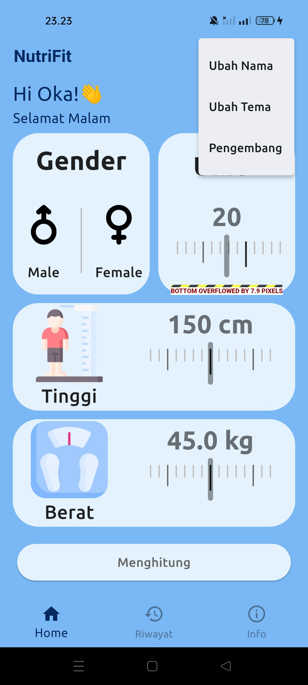 |
|  |  |  | 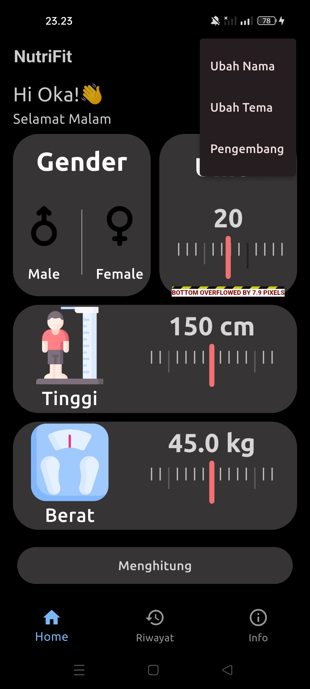 |

---

## ✨ Fitur

- 🎯 Kalkulator BMI berdasarkan usia, tinggi badan, berat badan, dan jenis kelamin
- 🔥 Kategori kesehatan yang dipersonalisasi (Normal, Overweight, Obese, etc.)
- 💡 Halaman Saran Cerdas dengan motivasi, makanan & tips olahraga
- 📜 Halaman Riwayat dari BMI yang pernah di lakukan
- ℹ️ Halaman Informasi Tentang NutriFit
- 🎨 Dukungan mode Terang/Gelap (Ubah tema)
- 🧑‍💼 Halaman Pengembang dengan tautan dan intro
- 🧠 UI yang mudah digunakan dibangun dengan Desain Material Flutter

---

## 🛠️ Tech Stack / Tumpukan Teknologi

- **Flutter** (UI Framework)
- **Dart** (Programming Language)
- **Shared Preferences** (Local storage)
- **Syncfusion Flutter Gauges** (Radial BMI gauge/Pengukur BMI Radial)
- **FontAwesome Icons** (Social & UI icons)

---

## 📄 Kebijakan Privasi (Privacy Policy)

Terakhir diperbarui: 2025

NutriFit berkomitmen untuk melindungi privasi dan data pengguna. Dokumen ini menjelaskan bagaimana aplikasi mengelola, menyimpan, dan menggunakan informasi yang Anda berikan. Dengan menggunakan NutriFit, Anda dianggap telah memahami dan menyetujui kebijakan privasi ini.

🔐 1. Informasi yang Dikumpulkan

NutriFit hanya mengumpulkan satu jenis informasi:

Nama pengguna (opsional)
Digunakan hanya untuk keperluan tampilan di dalam aplikasi.

Aplikasi tidak mengumpulkan informasi lain seperti email, lokasi, kontak, foto, atau data sensitif apa pun.

💾 2. Penggunaan Informasi

Data yang Anda berikan digunakan hanya untuk:

Menampilkan nama di dalam aplikasi

Menyimpan dan mengelola riwayat perhitungan BMI

Memberikan pengalaman penggunaan yang lebih personal

NutriFit tidak mengirimkan data ke server mana pun.

📁 3. Penyimpanan Data

Seluruh data disimpan secara lokal di perangkat Anda.

Aplikasi bersifat offline, sehingga tidak ada aktivitas pengunggahan data ke internet.

Pengguna dapat menghapus nama atau menghapus seluruh riwayat BMI kapan saja melalui fitur aplikasi.

🔒 4. Keamanan Data

Walaupun data yang disimpan tidak bersifat sensitif, NutriFit tetap memastikan bahwa:

Tidak ada pihak ketiga yang dapat mengakses data Anda

Tidak ada proses tracking, analitik, atau pengumpulan data otomatis

Semua data sepenuhnya berada di perangkat pengguna

👤 5. Hak Pengguna

Anda memiliki hak untuk:

Mengubah nama kapan saja

Menghapus riwayat BMI kapan saja

Menghapus aplikasi untuk menghapus seluruh data secara permanen

Karena data disimpan secara lokal, seluruh data akan hilang saat aplikasi dihapus.

📝 6. Perubahan Kebijakan Privasi

Kebijakan ini dapat diperbarui sewaktu-waktu. Perubahan akan diinformasikan melalui pembaruan aplikasi atau dokumentasi resmi di repositori GitHub.

📬 7. Kontak Developer

Jika Anda memiliki pertanyaan, masukan, atau laporan terkait aplikasi, silakan hubungi:

Email Developer: okabayu12344@gmail.com

---